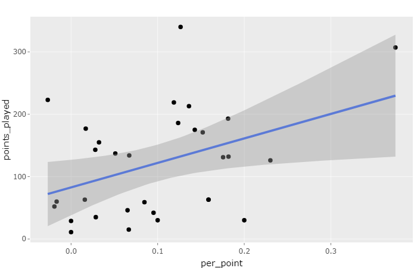
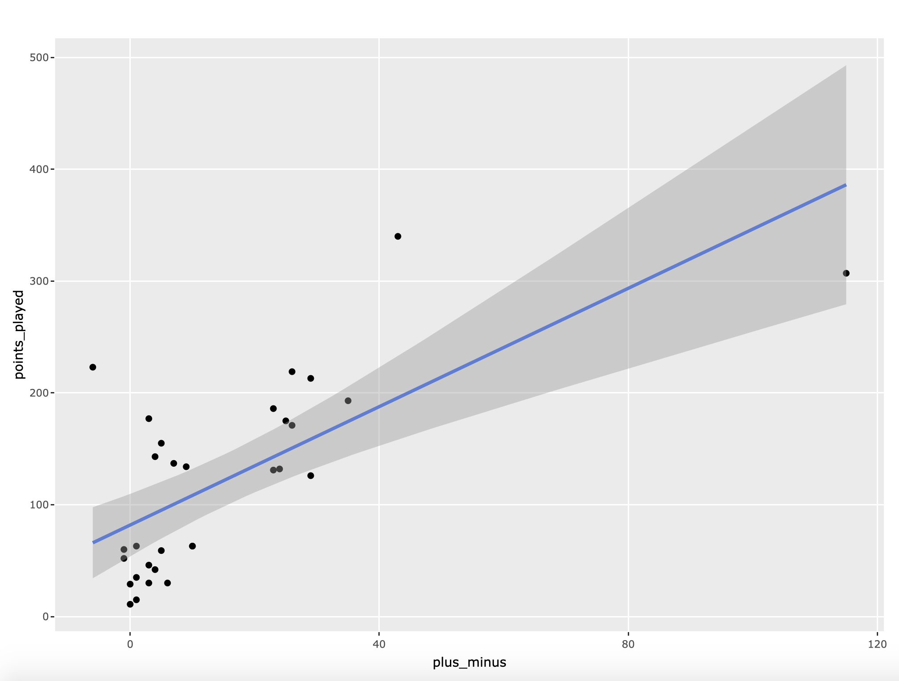
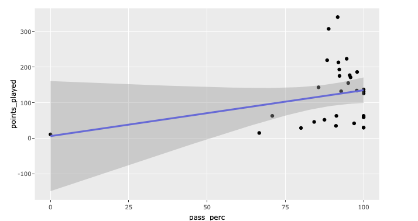

## Space Bastards: An Overview of Men's Club Ultimate, Spring 2019

### Introduction
Frisbee has become a staple, if not a cliche, of the college experience.  For most, it’s just throwing a disc around on campus green spaces.  For others, it is a sport that hours of hardwork, dedication, sweat, and tears are poured into over four years, maybe even five.  Club Ultimate Frisbee takes the casual games and tossing that pop up sporadically to the next level.  Practicing up to eight hours a week, spending time outside of practice working out at the gym or getting in reps with a disc, traveling hundreds of miles away to compete against other schools all are essential parts of the club ultimate experience at the University of Maryland.  

The men's team at UMD is, for some unknown reason, named the Space Bastards.  To help them strategize and develop players, they made use of UltiAnalytics, a site that can track individual and team frisbee stats throughout the season.  They filmed all their games this semester, in order to rewatch them to either learn about opposing teams or collect their own stats and input them into the UltiAnalytics system.  Positive stats include goals and assists.  Negative stats include throwawys (throwing a disc to someone who doesn't catch it) and turnovers, which include drops and stalls (losing the disc because you held it for longer than 10 seconds).  All of these components come together to create a picture, through data, of the team's strengths and weaknesses.

For many, data science may seem only important or applicable to large companies, government agencies, or academic endeavors.  Throughout this tutorial, we hope to show that anyone, even college students, can use data science to learn about the world around them and better their experiences.  In particular, this analysis and tutorial serves as an example for other college teams to make the most of their stats, find their goals improve their performance on the field.


### The Question

In our experiment, we asked:

_"Do better players actually get more playing time?"_

While someone may seem to be very skilled in practice, therefore gaining them playing time during tournaments, stats show us if it translates onto the field come game time.  It would be unfortunate if unrecognized, good players were overlooked or if overstated players were relied on too heavily, taking up playing time when they should be benched or developed more.  Specifically, we focused on player performance while on offense.  Through this analysis, we aimed to determine the relationship between offensive stats and playing time.

### Data Curation

Retrieving this data was simple.  The team has been personally building this dataset up over the past few months.  Collecting the data just required us to download it from [UltiAnalytics](https://www.ultianalytics.com/details.html).

Here are some terms concerning our dataset that you should know going forward:
 - Action: any drop, stall, turn, assist or goal
 - Playing time: how many points a player participated in during the season.  This is not a measure of time (like minutes or hours) a player spent on the field, but rather how many times he was one of the seven people put on the line at the beginnning of a point.  If you're unfamiliar with the game flow of an ultimate frisbee game, [click here](https://www.youtube.com/watch?v=YkMMqOUNyKk) to learn more.
 - Passing percentage: how many throws a player successfully completed
 - Line: the seven players who are on the field during a single point.  The line changes from one point to the next.
 
```markdown
 {r part 1, RESULTS=HIDE}
stats <- read_csv("SpaceBastards-stats.csv")

stats <- stats %>%
  select("Date/Time", tournament = "Tournamemnt", opponent = "Opponent", time = "Point Elapsed Seconds", "Line", 
         ourscore = "Our Score - End of Point", theirscore = "Their Score - End of Point", "Event Type", "Action", 
         "Passer", rec = "Receiver", "Defender", p0 = "Player 0", p1 = "Player 1", p2 = "Player 2", p3 = "Player 3", p4 = "Player 4",
         p5 = "Player 5", p6 = "Player 6")

stats
```

### Parsing and Data Management
Once we had the data, we had to do a lot of cleaning and maniupulation to make the data usable, as it was not in the same format that it appeared in on the very user-friendly site.  Columns needed to be renamed.

The biggest portion of this step was dedicated to calculating the Plus-Minus value for each player on the team, the means with which we were able to rank all the players from best to worst.  Plus-Minus is a mechanism that takes positive actions on the field and balances them against negative actions on the field.  A coach or captain can put into the system how many drops or turns a player was responsible for, as well as their goals and assists.  Drops, turns, and stalls each count as -1, while goals and assists count as +1.  All these actions are added together to create the player's Plus-Minus score.

```markdown
{r part 2}
plusminus <- stats
plusminus$Player <- ifelse(is.na(plusminus$Passer), plusminus$Defender,
                           ifelse(plusminus$Action == "Drop", plusminus$rec, plusminus$Passer))

plusminus <- plusminus %>% rbind(plusminus %>%
                                   filter(Action=="Goal") %>%
                                   mutate(Action="Score", Player=rec))
plusminus <- plusminus %>%
  select(Player, Action, rec) %>%
  group_by(Player) %>%
  count(Action) %>%
  select(Player, Action, n)

rows <- dim(plusminus)[1]; plusminus <- plusminus[1:(rows - 6),] #Remove last 6 entries, not useful
plusminus <- plusminus%>% 
  group_by(Player) %>%
  spread(key="Action",value=n) %>% 
  filter(Player != "0" &  Player != "Anonymous")
plusminus[is.na(plusminus)] <- 0

plusminus$plus_minus <- plusminus$Callahan + plusminus$D + plusminus$Goal+ plusminus$Score - plusminus$Stall - plusminus$Throwaway - plusminus$Drop

plusminus %>% select(Player, plus_minus)
```

Additionally, we needed to calculate how many points each player played.  In order to get these numbers for each person, we had to analyze each line, both offense and defense, for each game of the season.
```markdown
library(slam)
points <- stats %>%
  select(tournament, opponent, ourscore, theirscore, p0, p1, p2, p3, p4, p5, p6) %>%
  group_by(tournament, opponent, ourscore, theirscore, p0, p1, p2, p3, p4, p5 ,p6) %>%
  count()

points <-points %>% 
  ungroup() %>% 
  select(p0, p1, p2, p3, p4, p5 ,p6)

points_played <- as.data.frame(table(unlist(points)))
points_played
```
After all this data management, we put all the values we needed into one table.
```markdown
final_df <- plusminus
final_df$points_played <- points_played$Freq
final_df <- final_df%>%
  group_by(Player) %>%
  summarise_all(funs(first(na.omit(.)))) %>%
  select(Player, plus_minus, points_played)
final_df$per_point <- final_df$points_played / final_df$plus_minus
```

### Exploratory Data Analysis

In our exploratory data analysis, we visualize three plots using scatter plots with a trend. 

First, we analyze the per-points averages of players against their actual playing time. We create a trend on this plot that determines how much each player should play based on their performance per-point. This plot will also show if the plus minus system of evaluating skill correctly determines playing time.

```markdown
plot <- final_df %>% ggplot(mapping = aes(label=Player, x=per_point, y=points_played)) +
  geom_point()+ 
  geom_smooth(method=lm) 


ggplotly(plot, tooltip = c("Player", "per_point","points_played"))
```



Second, we create a plot for plus-minus versus points played. This is a a very direct correlation between playing time and plus-minus performance. From this, we can see if the players with higher or lower plus minuses are getting (or not getting) playing time accordingly. Interestingly enough, the highest plus-minus individual on the team falls below the trend for plus-minus to points played, whereas the second-highest individual lands way above the trend.

```markdown
plot <- final_df %>% ggplot(mapping = aes(label=Player, x=plus_minus, y=points_played)) +
  geom_point()+ 
  geom_smooth(method=lm) 


ggplotly(plot, tooltip = c("Player", "plus_minus","points_played"))
```



Last, we create a plot to visualize passing percentage vs points played. This is an interesting plot because it seems to show a very clear trend where players who have a low passing percentage do not play nearly as much as those with higher passing percentages. The trend is exaggerated by the fact that there are no outliers in terms of this principle. All 4 of the lowest passing percentage individuals fall below the trend on this plot. Some of the 100% passing percentage individuals are not values that should be considered, since they only throw a few passes over the course of the season, unlike others who throw many hundreds.

```markdown
pass_perc <- passing
pass_perc$points_played <- points_played$Freq
pass_perc <- pass_perc%>%
  summarise_all(funs(first(na.omit(.)))) %>%
  select(Player, pass_perc, points_played)
pass_perc

plot <- pass_perc %>% ggplot(mapping = aes(label=Player, x=pass_perc, y=points_played)) +
  geom_point()+ 
  geom_smooth(method=lm) 


ggplotly(plot, tooltip = c("Player"))
```


Overall, it seems that the data that we visualized here seems to align with our prediction that higher passing percentage and plus-minus individuals tend to see more playing time on the field.

### Hypothesis Testing and Machine Learning

# Null Hypothesis
As we are attempting to see if better players actually get more playing time, our null hypothesis is:

_Plus-Minus score will have no effect on playing time._

As Plus-Minus is our way of ranking players, our null hypothesis states that rankings will not help predict how much playing time someone gets.


### Conclusion
Our metric of the Plus-Minus may be misguided in ranking our players, as those who don't get a lot of playing time and never messed up when they were on the field may have an unusually high score, while a player who is on a lot has so many more opportunities to make good plays that any mistakes he makes become insignificant.  Yet, by not making completions (successfully catching the disc as receiver) a component of the Plus-Minus score, we made it more difficult for players that are on the field a lot to abuse this.  By only counting goals and assists--game-making plays--it forces out which players on the team contribute in the most important way to the offense.


 

